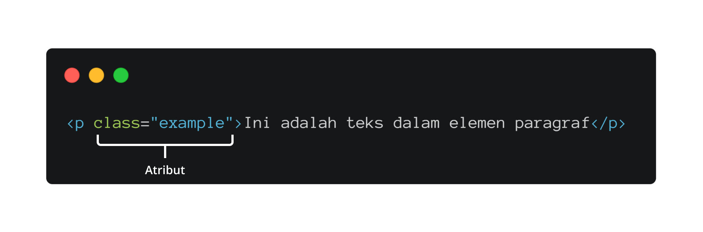
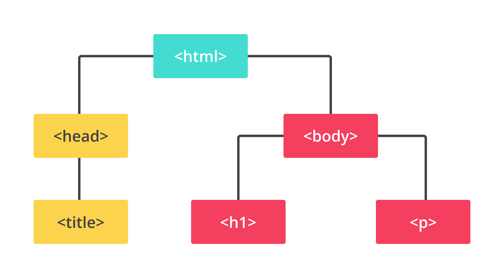
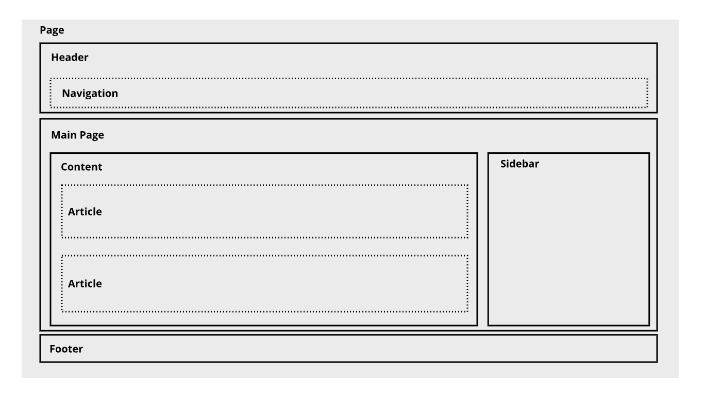
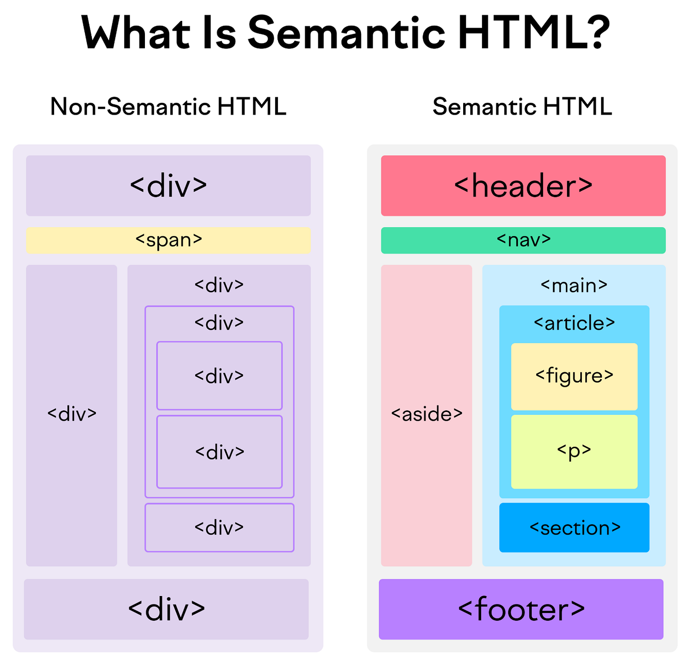
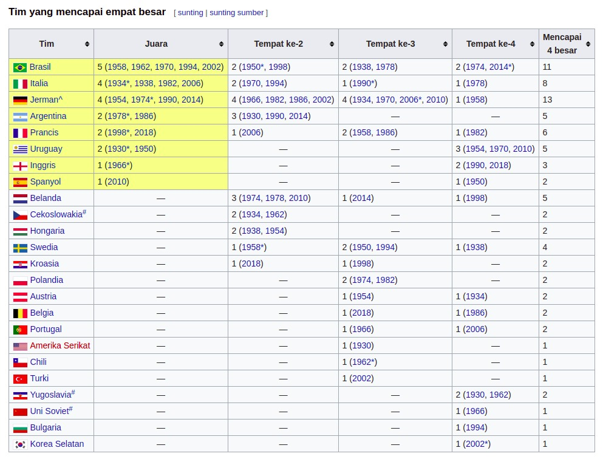
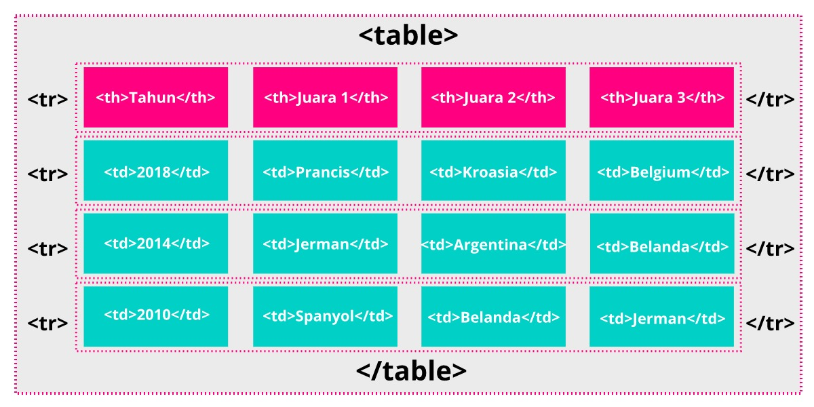
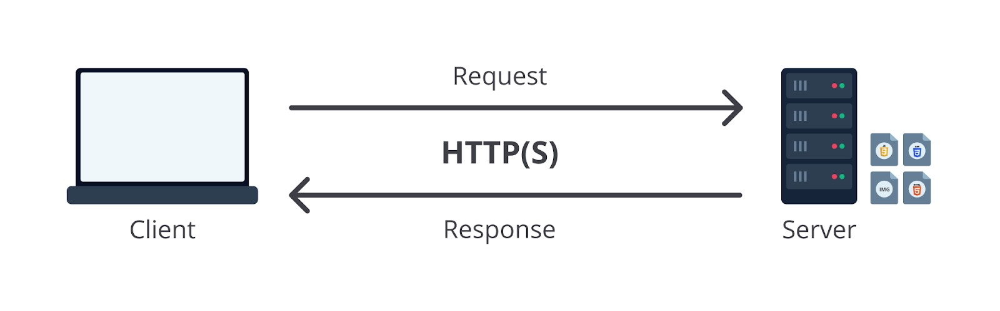

# Pengenalan dan Pendalaman HTML

## Pengertian HTML 


HTML (HyperText Markup Language) adalah bahasa dasar untuk membuat halaman web. HTML digunakan untuk menyusun elemen-elemen dalam sebuah halaman agar dapat ditampilkan di browser.

### Anatomi Elemen HTML 

Elemen HTML adalah salah satu bagian dari HTML dalam membangun halaman web. Elemen ini digunakan untuk mendefinisikan elemen-elemen yang ditampilkan dalam halaman web. Ada beberapa hal untuk membangun elemen HTML itu sendiri. Berikut adalah bagan dari anatomi elemen HTML.


Berikut adalah pembahasan dari masing-masing bagian dari bagan di atas.

Berikut adalah pembahasan dari masing-masing bagian dari bagan di atas.

| Item           | Keterangan |
|----------------|-----------|
| Tag Pembuka    | Berisi nama tag dari elemen yang akan dibuat dan dibungkus dengan angle bracket `< >`. Contohnya adalah `<p>` untuk membuat elemen paragraf (paragraph). |
| Konten         | Konten dari elemen. Contohnya teks sebagai konten dari elemen paragraf. |
| Tag Penutup    | Sama seperti tag pembuka, tetapi terdapat garis miring sebelum nama elemennya (`</p>`). Ini menandakan akhir dari elemen HTML. Kesalahan umum pemula adalah melupakan tag ini sehingga elemen menjadi tidak valid. |

### Atribute Elemen di HTML 

Dalam membuat elemen HTML, ada satu hal yang dapat dilakukan, yaitu memberi atribut. Atribut dapat memberi informasi-informasi tambahan untuk elemen HTML. Informasi ini tidak akan tampil dalam halaman web, tetapi ia dapat menentukan perilaku elemen biasanya. Berikut adalah anatomi dari atribut elemen untuk memperjelas pemahaman kamu.



### Anatomi Dokumen HTML

Pada dasarnya, dokumen HTML memerlukan struktur dasar untuk menampilkan halaman web dengan baik. Halaman web seharusnya memiliki susunan elemen HTML yang tampak seperti berikut.


Keterangan:

- `<!DOCTYPE html>` → Menandakan bahwa ini adalah dokumen HTML.

- `<html>` → Elemen utama yang membungkus seluruh isi halaman.

- `<head>` → Bagian kepala yang berisi informasi meta dan judul halaman.

- `<title>` → Menentukan judul yang muncul di tab browser.

- `<body>` → Bagian utama tempat konten halaman web ditampilkan.

Dokumen di atas sebetulnya akan membentuk sebuah hierarki elemen atau yang biasa disebut dengan DOM Tree (pohon DOM). Ini dapat Temen" analogikan seperti silsilah keluarga. Kurang lebih, berikut adalah DOM Tree yang terbentuk dari dokumen HTML di atas.



### Elemen dan Tag Dasar dalam HTML

| Elemen                  | Tag HTML                | Kegunaan |
|-------------------------|------------------------|----------|
| Heading                 | `<h1> - <h6>`          | Membuat judul atau heading |
| Paragraf                | `<p>`                  | Membuat sebuah paragraf |
| Divisi                  | `<div>`                | Membuat sebuah divisi atau wadah untuk mengelompokkan elemen lain |
| Gambar                  | `` | Menampilkan gambar |
| Tautan / Link           | `<a href="url">`       | Membuat teks hyperlink |
| Daftar Berurutan        | `<ol>`                 | Membuat sebuah daftar dengan nomor |
| Daftar Tidak Berurutan  | `<ul>`                 | Membuat sebuah daftar dengan bullet |
| Item                    | `<li>`                 | Membuat item di dalam tag `<ul>` atau `<ol>` |
| Garis Horizontal        | `<hr>`                 | Membuat sebuah garis horizontal |
| Baris Baru              | `<br>`                 | Membuat sebuah baris baru |

### Contoh Penggunaan Tag Dasar HTML

```html
<!DOCTYPE html>
<html>
<head>
    <title>Belajar HTML</title>
</head>
<body>
    <h1>Judul Utama</h1>
    <h2>Judul Kedua</h2>
    <p>Ini adalah sebuah paragraf yang menjelaskan sesuatu.</p>
    
    <a href="https://www.google.com">Kunjungi Google</a>
    
    
    
    <h3>Daftar Belanja</h3>
    <ul>
        <li>Apel</li>
        <li>Pisang</li>
        <li>Jeruk</li>
    </ul>
    
    <h3>Langkah-langkah Memasak</h3>
    <ol>
        <li>Siapkan bahan.</li>
        <li>Panaskan wajan.</li>
        <li>Masak hingga matang.</li>
    </ol>
</body>
</html>
```

## Semantic HTML: Mengorganisasikan Halaman Konten

Website memiliki hierarki konten yang sama seperti dokumen sehari-hari yang kita baca, majalah, dan koran. Jadi, hierarki pada sebuah website merupakan hal yang penting. Tentu elemen yang terdapat pada HTML perlu kita kelompokkan menjadi beberapa bagian.



Kita dapat menggunakan beberapa elemen dalam HTML untuk mengelompokkan sebuah elemen dengan jelas dan memiliki arti (semantic meaning). Elemen-elemen ini memiliki nama sesuai dengan fungsi atau peran dari elemen tersebut.


### Semantic VS Non-Semantic HTML



### Generic Elements
HTML menyediakan dua tipe elemen umum (generic element) yang bisa kita kustomisasi untuk menggambarkan konten kita dengan tepat, yaitu div dan span. Elemen ini akan terlibat jika tidak ada semantic element sesuai di HTML.

1. Div
Elemen `<div>` merupakan sebuah wadah (container) yang bersifat umum untuk menampung beberapa konten. Elemen ini tidak akan memberikan efek apa pun pada konten atau layout sebelum menerapkan sebuah style menggunakan CSS.

```html
<!DOCTYPE html>
<html>
  <head>
    <title>Div Element</title>
    <link rel="stylesheet" href="styles.css">
  </head>
  <body>
    <div class="shadowbox">
      <p>
        Paragraf ini berada di dalam elemen div, tetapi ia akan ditampilkan sama seperti paragraf
        biasanya. Elemen ini lebih sering digunakan untuk mengelompokkan sebuah konten sehingga
        dapat memudahkan styling dengan menggunakan atribut class atau id.
      </p>
    </div>
  </body>
</html>
```

2. Span
Elemen `<span>` memberikan manfaat yang sama seperti `<div>`, bedanya elemen ini digunakan sebagai phrase elements dan tidak terdapat line breaks ketika menggunakannya. Sederhananya, `<span>` merupakan sebuah `<div>` yang digunakan dalam sebuah baris teks yang dapat diwadahi oleh paragraf, list, heading, atau lainnya.

```html
<style>
  .phone {
    font-weight: bold;
  }
</style>

<ul>
  <li>Agil: <span class="phone">08123xxx</span></li>
  <li>Widy: <span class="phone">08222xxx</span></li>
  <li>Gilang: <span class="phone">08333xxx</span></li>
</ul>
```

### Tabel 
Elemen `<table>` pada HTML merepresentasikan data tabular, yaitu informasi yang disajikan dalam sebuah tabel. Tabel sendiri disajikan dalam dua dimensi terdiri dari baris dan kolom (cell) yang berisikan sebuah data. Berikut adalah contoh data sepak bola yang disajikan dalam bentuk tabel.



### Struktur Dasar Tabel
Tabel pada HTML disusun dari tiga buah elemen, yaitu `<table>`, `<tr>` dan `< td >` atau `<th>`. Elemen `<table>` digunakan untuk menandakan dimulainya dan diakhirinya sebuah konten tabel dan juga sebagai wadah untuk tabel itu sendiri. Kemudian elemen `<tr>` digunakan untuk membuat sebuah baris baru yang di dalamnya terdapat elemen `<td>` atau `<th>` sehingga menghasilkan sebuah sel.



### Spanning Cell (Merging Cell)

Dalam aplikasi seperti Microsoft Word, hal ini biasa dikenal sebagai *merging cell* atau menggabungkan sel. Fitur ini merupakan dasar dalam pembuatan tabel, dan pada HTML juga dapat dilakukan.

Pada HTML, konsep ini disebut *spanning cell*, yaitu memperluas ukuran sel melebihi ukuran normalnya. Terdapat dua jenis *spanning cell*:

---

### 1. Column Spans

Untuk merentangkan sebuah kolom (*column spanning*), digunakan atribut `colspan` pada elemen `<td>` atau `<th>`.

```html
<h2>Column Span</h2>
<table border="1">
  <tr>
    <th>18:00</th>
    <th>19:00</th>
    <th>20:00</th>
  </tr>
  <tr>
    <td colspan="2">Avenger Infinity Wars</td>
    <td>It Chapter 2</td>
  </tr>
  <tr>
    <td>One Piece: Stampede</td>
    <td>Weathering With You</td>
    <td>Gundala</td>
  </tr>
  <tr>
    <td>Gundala</td>
    <td colspan="2">Avenger Infinity Wars</td>
  </tr>
</table>
```

### 2. Row Spans

Untuk merentangkan sebuah baris (*row spanning*), digunakan atribut `rowspan` pada elemen `<td>` atau `<th>`. Atribut ini membuat sebuah sel memanjang ke bawah dan mencakup beberapa baris sekaligus.

```html
<h2>Row Span</h2>
<table border="1">
  <tr>
    <th rowspan="3">18:00</th>
    <td>Avenger Infinity Wars</td>
  </tr>
  <tr>
    <td>One Piece: Stampede</td>
  </tr>
  <tr>
    <td>Gundala</td>
  </tr>
</table>
```

### Input User

Hampir semua website memiliki elemen input untuk menerima data dari pengguna. Data tersebut nantinya akan diproses sesuai kebutuhan sistem.

HTML menyediakan berbagai jenis input yang dapat digunakan untuk membuat formulir. Berikut beberapa di antaranya.

---

### 1. Input Element

Elemen `<input>` merupakan elemen yang paling sering digunakan untuk menerima data dari pengguna. Hal ini karena `<input>` memiliki banyak tipe, seperti teks, number, email, password, dan lain-lain.

Selain itu, setiap tipe input juga didukung oleh atribut tertentu yang membuat pembuatan formulir menjadi lebih fleksibel.

```html
<div>
  Text:
  <input type="text" />
</div>

<div>
  Number:
  <input type="number" />
</div>

<div>
  Email:
  <input type="email" />
</div>

<div>
  Password:
  <input type="password" />
</div>
```

### 2. Textarea Element

Elemen `<textarea>` digunakan untuk memungkinkan pengguna menuliskan teks dalam beberapa baris.

Berbeda dengan elemen `<input>`, `<textarea>` memiliki tag pembuka dan penutup.

```html
<textarea rows="6" cols="16">
Belajar
Dasar
Pemrograman
Web
</textarea>
```

### 3. Label Element

Elemen `<label>` digunakan untuk memberikan keterangan pada elemen input. Penggunaannya memiliki beberapa keuntungan:

- Membantu screen reader dalam menjelaskan fungsi input.
- Memungkinkan pengguna langsung fokus ke input saat label diklik.

```html
<div>
  <label for="email">Email</label>
  <br>
  <input type="email" id="email" />
</div>

<div>
  <label for="password">Password</label>
  <br>
  <input type="password" id="password" />
</div>
```

### 4. Atribut pada Elemen Input

Elemen `<input>` memiliki berbagai atribut yang dapat digunakan untuk memaksimalkan fungsi formulir.

Beberapa atribut yang sering digunakan antara lain:
- `placeholder` → memberikan petunjuk pengisian
- `required` → menandakan bahwa input wajib diisi
- `value` → memberikan nilai default pada input
- `disabled` → menonaktifkan input
- `readonly` → membuat input hanya bisa dibaca tanpa bisa diubah

Berikut contoh penggunaannya:

```html
<div>
  <label for="email">Email</label>
  <br />
  <input type="email" id="email" placeholder="example@mail.com" required />
</div>

<div>
  <label for="password">Password</label>
  <br />
  <input type="password" id="password" placeholder="********" required />
</div>

<div>
  <label for="username">Username</label>
  <br />
  <input type="text" id="username" value="user123" />
</div>

<div>
  <label for="status">Status</label>
  <br />
  <input type="text" id="status" value="Aktif" readonly />
</div>

<div>
  <label for="promo">Kode Promo</label>
  <br />
  <input type="text" id="promo" disabled />
</div>
```
> **Catatan:**
> Elemen `<label>` tidak dapat digantikan oleh atribut `placeholder`.
> `placeholder` hanya berfungsi sebagai petunjuk pengisian, sedangkan `<label>` berfungsi sebagai keterangan dari input.

## Mengirim Data Formulir



Ketika client membutuhkan resources guna menampilkan halaman web ke pengguna, ia akan mengirimkan request ke server tentang kebutuhan yang dimaksud. HTML, CSS, JavaScript, serta aset-aset lainnya merupakan resources yang akan dikirimkan dan di-render oleh browser sehingga tampillah halaman web yang utuh. Nah, hal tersebut merupakan proses yang serupa yang akan dilakukan oleh browser dan server.


Ada satu elemen yang berfungsi sebagai wrapper (pembungkus) dari keseluruhan kolom input atau formulir. Elemen yang dimaksud adalah `<form>`.

```html
<form>
  <div>
    <label for="email">Email</label>
    <br />
    <input type="email" id="email" />
  </div>

  <div>
    <label for="password">Password</label>
    <br />
    <input type="password" id="password" />
  </div>

  <button type="submit">Submit</button>
</form>
```

## Special Character

Ada beberapa karakter spesial seperti copyright symbol (©) yang tidak termasuk ke dalam standar kelompok ASCII characters. ASCII characters hanya menyediakan karakter seperti huruf, nomor, dan beberapa simbol dasar lainnya.

HTML memerlukan sebuah “escaped” character untuk menampilkan karakter khusus. Ada dua cara untuk melakukannya, yakni menetapkan nilai numerik (*numeric entity*) atau menggunakan nama singkatan yang sudah ditetapkan untuk masing-masing karakternya (*named entity*). Semua referensi karakter dimulai dengan “&” dan diakhiri dengan “;”.

```html
<p>Website ini dilindungi hak cipta &copy; 2025</p>
<!-- Juga bisa menggunakan &#169; -->
<p>Website ini dilindungi hak cipta &#169; 2025</p>
```

## Kesimpulan

- HTML adalah bahasa dasar untuk membuat halaman web.
- Struktur HTML terdiri dari `<html>`, `<head>`, dan `<body>`.
- Elemen HTML menggunakan tag untuk menampilkan berbagai jenis konten.
- Dengan HTML, kita bisa membuat teks, gambar, tautan, dan daftar dengan mudah.
- Semantic HTML memungkinkan data di dalam web dipahami oleh mesin / komputer.

## Referensi Tambahan

- [HTML Tutorial (W3School)](https://www.w3schools.com/html/)
- [HTML Tutorial (GeeksforGeeks)](https://www.geeksforgeeks.org/html-tutorial/)
- [HTML Semantics](https://www.w3schools.com/html/html5_semantic_elements.asp)
- [HTML Elements](https://developer.mozilla.org/en-US/docs/Web/HTML/Element)
- [HTML Attribute](https://developer.mozilla.org/en-US/docs/Web/HTML/Attributes)
