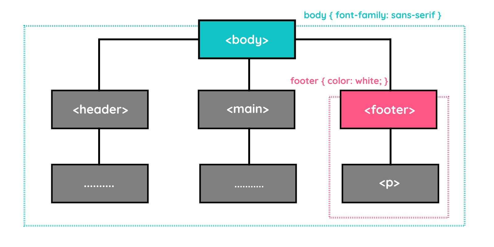
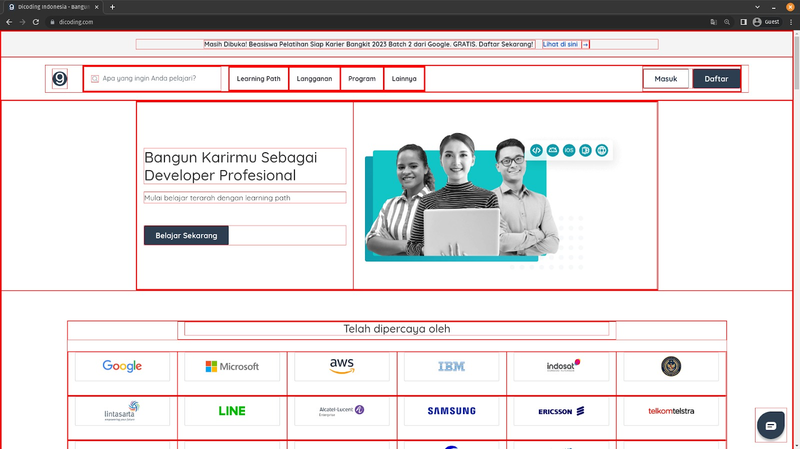
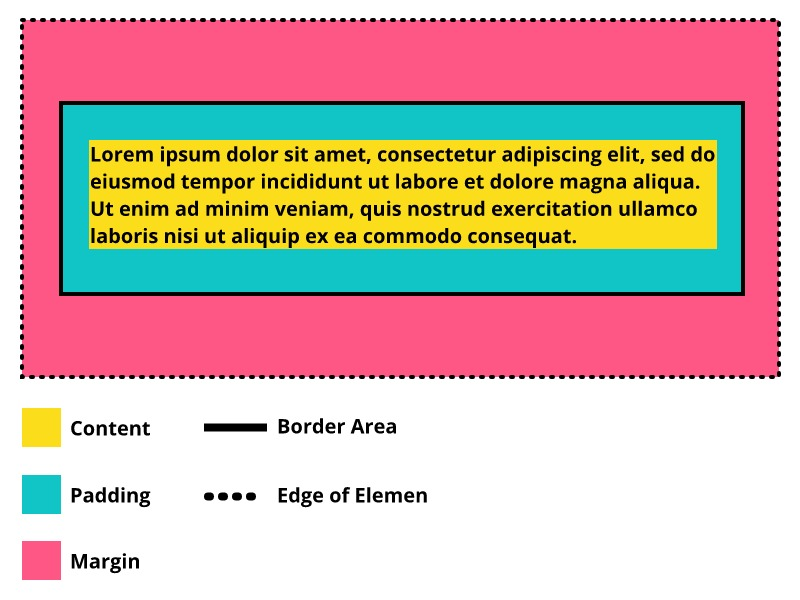
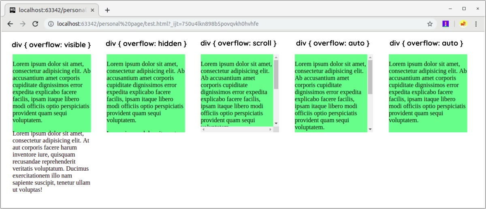
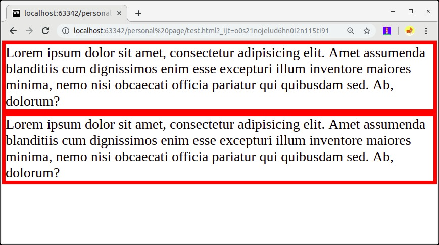
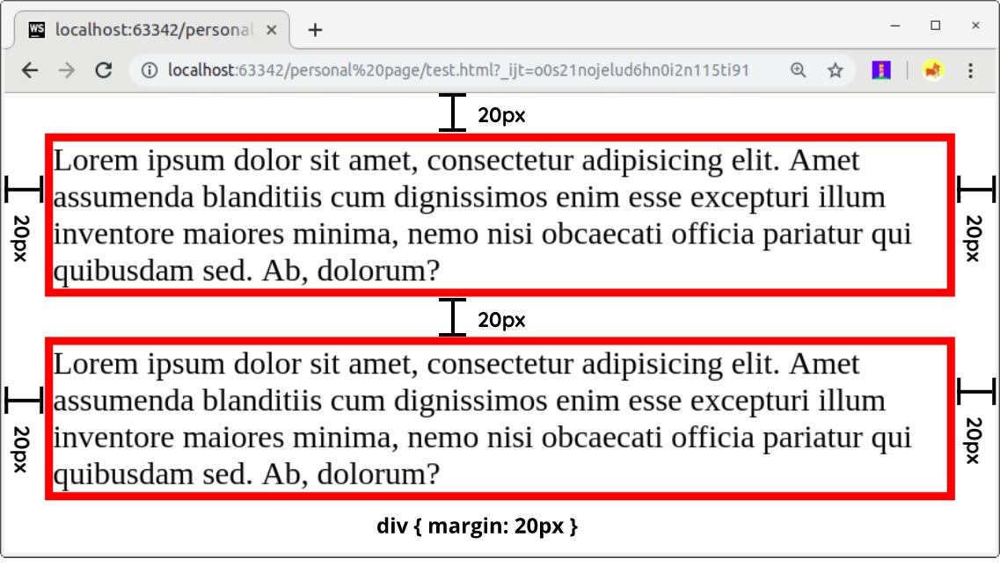

# Pengenalan dan Pendalaman CSS 

## Pengantar CSS

### Pengantar Pengenalan CSS


Website akan terlihat kurang menarik tanpa adanya CSS. **CSS (Cascading Style Sheet)** merupakan standar dari *W3C* yang digunakan untuk mengatur tampilan atau visualisasi halaman HTML. CSS bersifat *declarative language*, yaitu digunakan untuk mendeklarasikan nilai-nilai yang berfungsi mengatur tampilan elemen HTML di browser.

### Keuntungan dan Cara CSS Bekerja
Dengan menerapkan CSS, tampilan website akan menjadi lebih menarik.  
Berikut beberapa keuntungan menggunakan CSS:

- **Mengatur layout dengan presisi**  
  CSS memungkinkan kita membuat tampilan website yang rapi dan terstruktur, bahkan menyerupai desain dokumen cetak.

- **Menghindari penulisan berulang**  
  Styling dapat diterapkan ke banyak halaman HTML hanya dengan satu file CSS, sehingga lebih efisien.

- **Didukung oleh banyak browser**  
  Hampir semua browser modern sudah mendukung CSS, minimal CSS versi 2, dan sebagian besar sudah mendukung CSS versi 3.


### Menulis Aturan Styling
Dalam CSS, sebuah *rule* terdiri dari dua bagian utama:

- **Selector**  
  Bagian yang digunakan untuk menentukan elemen HTML mana yang akan diberi styling.

- **Declaration**  
  Bagian yang berisi aturan atau instruksi styling yang akan diterapkan pada selector.


### Melampirkan Styling pada Dokumen HTML

Berikut adalah beberapa cara untuk melampirkan CSS ke dalam dokumen HTML:

---
### 1. External Style Sheet

**External Style Sheet** adalah file terpisah yang berisi kumpulan aturan CSS. File ini memiliki ekstensi `.css` dan dihubungkan ke dokumen HTML. Metode ini merupakan cara yang paling direkomendasikan karena lebih rapi dan efisien. Selain itu, satu file CSS dapat digunakan untuk mengatur tampilan pada banyak halaman HTML sekaligus.

#### Keunggulan:
- Dapat digunakan di banyak halaman  
- Lebih rapi dan terstruktur  
- Mudah dikelola  

```html
<head>
  <meta charset="UTF-8" />
  <title>Judul Dokumen</title>

  <!-- Impor berkas CSS Anda -->
  <link rel="stylesheet" href="style.css">
</head>
```

### 2. Embedded Style Sheet
**Embedded Style Sheet** adalah aturan CSS yang dituliskan langsung di dalam dokumen HTML menggunakan elemen `<style>`. Biasanya, penulisan CSS ini ditempatkan di dalam bagian `<head>` pada dokumen HTML.

```html
<head>
  <meta charset="UTF-8" />
  <title>Judul Dokumen</title>

  <style>
    h1 {
      color: green;
    }
  </style>
</head>
```

### 3. Inline Style

**Inline Style** adalah cara menerapkan CSS langsung pada elemen HTML menggunakan atribut `style`.

```html
<p style="color: green;">Konten dari elemen HTML</p>
```

Jika ingin menambahkan lebih dari satu properti, gunakan semicolon (;) sebagai pemisah:
```html
<p style="color: green; font-size: 18px;">Contoh teks</p>
```

> **Catatan:**  
> Inline style biasanya digunakan untuk kebutuhan khusus dan tidak disarankan untuk penggunaan dalam skala besar karena sulit dikelola.

## Konsep Dasar CSS

### CSS Conception

Sebelum membahas styling lebih lanjut, penting untuk memahami beberapa konsep dasar dalam CSS yang membantu kita memahami bagaimana CSS bekerja dalam mengatur tampilan elemen HTML serta bagaimana aturan styling saling berinteraksi, sehingga kita dapat menulis kode yang lebih terstruktur, efisien, dan mudah dikelola.

### Inheritance

Styling pada CSS bersifat *inheritance*, yaitu beberapa properti dapat diwariskan dari elemen induk (*parent*) ke elemen di dalamnya (*child elements*).

Sebagai contoh, aturan CSS yang diterapkan pada elemen `<body>` akan secara otomatis memengaruhi seluruh elemen di dalamnya. Begitu juga jika pada elemen `<footer>` diberikan properti `color: white`, maka seluruh teks di dalam `<footer>` akan mengikuti warna tersebut.

Hal ini menunjukkan bahwa pemahaman terhadap struktur dokumen HTML sangat penting dalam penggunaan CSS.

#### Contoh:

```html
<!DOCTYPE html>
<html>
<head>
  <meta charset="UTF-8" />
  <title>CSS Inheritance Example</title>

  <link rel="stylesheet" href="styles.css" />
</head>
<body>
  <header>
    <h1>Inheritance di CSS</h1>
  </header>
  <main>
    <h2>Lorem Ipsum</h2>

    <article>
      <h3>Lorem, ipsum dolor.</h3>
      <p>
        Pellentesque venenatis mi sit amet erat tincidunt auctor. Curabitur tincidunt tellus ac
        convallis dictum. Morbi luctus leo eget leo luctus elementum. Cras at ligula eu elit
        blandit venenatis.
      </p>
    </article>
  </main>
  <footer>
    <p>Hak Cipta &copy; 2023</p>
  </footer>
</body>
</html>
```

```css
body {
  font-family: sans-serif;
}

footer {
  color: white;
}
```
Berikut adalah hasil penerapan contoh studi kasus di atas.

 

> **Catatan:**  
> Tidak semua properti CSS dapat diwariskan. Contohnya, properti seperti `margin` dan `padding` tidak akan diwariskan secara otomatis.

### Group Selector

Jika beberapa selector memiliki properti yang sama, kita dapat menggabungkannya menggunakan *group selector*. Dengan cara ini, penulisan kode menjadi lebih ringkas dan dapat menghindari pengulangan yang tidak perlu.
```css
h2 {
  color: #00A2C6;
}

h3 {
  color: #00A2C6;
}
```
Dalam kasus seperti di atas, kita dapat menuliskan beberapa selector sekaligus dalam satu *rule*. Gunakan tanda koma (`,`) untuk memisahkan setiap selector.

Perhatikan contoh berikut:
```html
<!DOCTYPE html>
<html>
  <head>
    <meta charset="UTF-8" />
    <title>Judul Dokumen</title>

    <link rel="stylesheet" href="styles.css">
  </head>
  <body>
    <h2>Judul dengan Heading 2</h2>
    <h3>Judul dengan Heading 3</h3>
  </body>
</html>
```

```css
h2, h3 {
  color: #00A2C6;
}
```

### Rule Order

Sesuai dengan namanya, *cascading* berarti “mengalir”. Dalam CSS, aturan styling dibaca dari atas ke bawah. Oleh karena itu, urutan penulisan *rule* sangat penting, terutama ketika terjadi konflik antar styling. Konflik dapat terjadi ketika beberapa aturan diterapkan pada elemen yang sama dan saling menimpa.

Sebagai contoh, jika pada *external CSS* elemen `<p>` diberi warna merah, tetapi pada *embedded CSS* diberi warna biru, maka warna yang akan ditampilkan adalah warna yang terakhir didefinisikan, yaitu biru. Hal ini terjadi karena CSS mengikuti prinsip *cascading*, yaitu aturan yang ditulis paling akhir akan memiliki prioritas lebih tinggi.

Perhatikan contoh berikut:

```html
<!DOCTYPE html>
<html>
  <head>
    <meta charset="UTF-8" />
    <title>Judul Dokumen</title>

    <link rel="stylesheet" href="styles.css">

    <style>
      p {
        color: blue;
      }
    </style>
  </head>
  <body>
    <p>
      Sesuai dengan namanya cascading yang artinya <q>mengalir</q>, alur kerja CSS dalam membaca
      kode pun seperti itu. Mengalir dari atas ke bawah sehingga kita harus memperhatikan urutan
      dalam penulisan rules <i>styling</i>.
    </p>
  </body>
</html>
```

```css
p {
  color: red;
}
```

Namun, kita dapat memaksa sebuah properti CSS agar memiliki prioritas lebih tinggi dengan menggunakan keyword `!important`. Dengan menambahkan `!important` di akhir nilai properti, aturan tersebut akan tetap diterapkan meskipun ada aturan lain yang ditulis setelahnya.

```css
p {
  color: red !important;
}
```

> **Catatan:**  
> Gunakan `!important` hanya jika benar-benar diperlukan. Sebaiknya pahami terlebih dahulu aturan urutan (*cascading*) dalam CSS agar penggunaan `!important` dapat diminimalkan.

Berikut adalah beberapa konsep yang telah dipelajari terkait styling pada CSS:
- **Rule**: Aturan styling yang diterapkan pada elemen HTML. Sebuah *rule* terdiri dari *selector* dan *declaration*.
- **Selector**: Bagian yang digunakan untuk menentukan elemen HTML yang akan diberi styling.
- **Declaration**: Bagian dari *rule* yang berisi pasangan properti dan nilai (*property: value*).
- **External Style Sheet**: Berkas terpisah (berekstensi `.css`) yang berisi satu atau lebih *rule* dan digunakan untuk mengatur tampilan beberapa halaman HTML.
- **Embedded Style Sheet**: Kumpulan *rule* yang dituliskan langsung di dalam dokumen HTML menggunakan elemen `<style>`.
- **Inline Style**: Styling yang diterapkan langsung pada elemen HTML melalui atribut `style`.

## Pendalaman CSS
### Pengantar Pendalaman CSS

Pada modul ini, kita akan mempelajari CSS secara lebih mendalam. Beberapa topik yang akan dibahas meliputi berbagai jenis *selector*, pengaturan teks (*text formatting*), pewarnaan, *box model*, *positioning*, hingga penyusunan layout pada website menggunakan teknik *floating*.

## Selector Dasar
CSS memiliki berbagai jenis *selector* yang digunakan untuk menargetkan elemen tertentu dalam dokumen HTML.  

Pada modul sebelumnya, kita telah mempelajari pengertian *selector* dan cara penggunaannya. Selector yang telah digunakan tersebut termasuk dalam kategori *basic selector*.  

Berikut adalah beberapa jenis *basic selector* dalam CSS:
- Type Selector  
- Class Selector  
- ID Selector  
- Attribute Selector  
- Universal Selector  

Selanjutnya, kita akan membahas masing-masing *selector* tersebut satu per satu.

--- 
### 1. Type Selector
Type selector menggunakan nama elemen sebagai target untuk diterapkannya *rule*. Dengan kata lain, ketika menggunakan selector ini, *rule* akan diterapkan pada seluruh elemen target yang ada pada dokumen HTML. Contohnya sebagai berikut.

```html
<!DOCTYPE html>
<html>
  <head>
    <meta charset="UTF-8" />
    <title>Judul Dokumen</title>
    <link rel="stylesheet" href="styles.css" />
  </head>
  <body>
    <span>
      Ini merupakan sebuah teks yang berada pada elemen span. Seharusnya elemen
      ini ditampilkan dengan warna teks merah.
    </span>
    <p>
      Ini merupakan sebuah teks yang berada pada elemen paragraf, teks ini tidak
      seharusnya tidak akan terpengaruh oleh rule.
    </p>
    <span>
      Ini merupakan sebuah teks yang berada pada elemen span lainnya. Seharusnya
      elemen ini ditampilkan dengan warna teks merah juga.
    </span>
  </body>
</html>
```

```css
/* Semua elemen span */
span {
  color: red;
}
```

Jika berkas tersebut dibuka pada browser, teks yang berada pada setiap elemen `<span>` akan berwarna merah.

### 2. Class Selector

Class selector menetapkan target elemen berdasarkan nilai dari atribut `class` yang diterapkan pada elemen tersebut. Penulisan selector diawali dengan tanda titik (`.`), kemudian diikuti dengan nama class. Contohnya sebagai berikut.

```html
<!DOCTYPE html>
<html>
  <head>
    <meta charset="UTF-8" />
    <title>Judul Dokumen</title>

    <link rel="stylesheet" href="styles.css" />
  </head>
  <body>
    <p class="red">Paragraf dengan teks berwarna merah</p>
    <p class="skyblue-bg">Paragraf dengan background berwarna biru langit</p>
    <p class="fancy">Paragraf dengan gaya fancy</p>
    <p>
      Paragraf yang menampilkan teks dengan warna standar tanpa menerapkan
      styling
    </p>
  </body>
</html>
```

```css
.red {
  color: red;
}

.skyblue-bg {
  background-color: skyblue;
}

.fancy {
  font-weight: bold;
  text-shadow: 4px 4px 3px #77f;
}
```

### 3. ID Selector

ID selector menetapkan target elemen berdasarkan nilai dari atribut `id` yang diterapkan pada elemen tersebut. Mirip dengan `class`, atribut `id` dapat digunakan pada berbagai elemen HTML dan umumnya dimanfaatkan untuk memberikan identitas pada elemen generik, seperti `<div>` dan `<span>`. Namun, atribut `id` tidak bersifat *shareable*. Artinya, nilai `id` harus unik dan hanya digunakan pada satu elemen saja.  

Untuk menuliskan selector menggunakan `id`, kita menggunakan tanda pagar (`#`) atau yang dikenal sebagai *hash*. Berikut contohnya.


```html
<!DOCTYPE html>
<html>
  <head>
    <meta charset="UTF-8" />
    <title>Judul Dokumen</title>

    <link rel="stylesheet" href="styles.css" />
  </head>
  <body>
    <div id="special">
      <p>Ini merupakan konten di dalam sebuah div yang diberi id special.</p>
    </div>
    <div>
      <p>Ini merupakan konten di dalam sebuah div biasa.</p>
    </div>
  </body>
</html>
```
```css
#special {
  background-color: skyblue;
}
```

> Perlu ditekankan bahwa `id` bersifat unik dan hanya digunakan pada satu elemen. Jika ingin menerapkan *rule* pada banyak elemen, sebaiknya gunakan atribut `class` dibandingkan `id`.

```html
<!DOCTYPE html>
<html lang="en">
  <head>
    <title>Judul Dokumen</title>
    <style>
      #special {
        background-color: skyblue;
      }
    </style>
  </head>
  <body>
    <div id="special">
      <p>Ini merupakan konten di dalam sebuah div yang diberi id special.</p>
    </div>

    <!-- ini merupakan contoh yang salah dalam penerapan id -->
    <div id="special">
      <p>Ini merupakan konten di dalam sebuah div biasa.</p>
    </div>
  </body>
</html>
```
### 4. Attribute Selector

Attribute selector merupakan cara untuk menetapkan target elemen berdasarkan atribut yang digunakan, atau bahkan lebih spesifik berdasarkan nilai dari atribut tersebut. Contohnya sebagai berikut.

```html
<!DOCTYPE html>
<html>
  <head>
    <meta charset="UTF-8" />
    <title>Attribute Selector</title>

    <link rel="stylesheet" href="styles.css" />
  </head>
  <body>
    <ul>
      <li><a href="#internal">Internal link</a></li>
      <li><a href="http://example.com">Example link</a></li>
      <li><a href="#InSensitive">Insensitive internal link</a></li>
      <li><a href="http://example.org">Example org link</a></li>
    </ul>
  </body>
</html>
```

```css
ul {
  font-size: 18px;
}

/* <a> element yang menerapkan href attribute */
a[href] {
  color: blue;
}

/* <a> element yang menerapkan nilai pada href dengan awalan "#" */
a[href^='#'] {
  background-color: gold;
}

/* <a> element yang menerapkan nilai pada href yang mengandung teks "example" */
a[href*='example'] {
  background-color: silver;
}

/* <a> element yang menerapkan nilai pada href yang mengandung teks "insensitive" tidak mementingkan huruf kapital*/
a[href*='insensitive' i] {
  color: cyan;
}

/* <a> element yang menerapkan nilai pada href dengan akhiran ".org" */
a[href$='.org'] {
  color: red;
}
```

### 5. Universal Selector  

Universal selector digunakan untuk menargetkan seluruh elemen dalam dokumen HTML. Namun, selector ini juga dapat digunakan secara lebih spesifik dengan menggabungkannya bersama selector lain. Berikut contohnya.

```html
<!DOCTYPE html>
<html lang="id">
  <head>
    <meta charset="UTF-8" />
    <title>Judul Dokumen</title>

    <link rel="stylesheet" href="styles.css" />
  </head>
  <body>
    <p>
      Ini merupakan paragraf biasa atau tidak menerapkan atribut apapun. Maka
      teks pada paragraf ini akan berwarna hijau
    </p>
    <p lang="en-us">
      This is an English paragraph contains en-us value of lang attribute, so
      this text will be green and italic.
    </p>

    <h1>Ini merupakan sebuah header biasa</h1>
    <h1 lang="en-us">This is an English Header</h1>

    <p class="warning">
      Perhatikan paragraf ini! Paragraf ini merupakan paragraf yang memiliki
      kelas bernilai warning, sehingga teks dari paragraf ini akan berwarna
      merah
    </p>

    <div id="content">
      <p>
        Ini merupakan sebuah teks di dalam sebuah div yang memiliki id bernilai
        "content", seharusnya paragraf ini dibungkus dalam border yang memiliki
        padding 20px
      </p>
    </div>
  </body>
</html>
```

```css
/* Menargetkan seluruh tipe elemen */
* {
  color: green;
}

/* Menargetkan seluruh tipe elemen yang mengandung nilai "en" pada atribut lang */
*[lang^='en'] {
  font-style: italic;
}

/* Menargetkan seluruh tipe elemen yang memiliki nilai "warning" pada atribut class */
*.warning {
  color: red;
}

/* Menargetkan seluruh tipe elemen yang memiliki nilai "content" pada atribut id */
*#content {
  border: 1px solid blue;
  padding: 20px;
}
```

## Box Model 

 

Setiap elemen yang dibuat pada HTML akan menciptakan sebuah kotak untuk menampung kontennya. Layaknya bentuk kotak pada umumnya, ada beberapa nilai atau komponen padanya.

- Lebar dan tinggi pada kotak (konten).
- Ruang kosong antara konten dengan border (padding).
- Garis tepi (border).
- Jarak dari elemen lain (margin).

Pada CSS, kita dapat mengatur nilai-nilai tersebut. Inilah yang disebut dengan box model.

## Apa itu Box Element

 

Sebagaimana yang kita lihat pada gambar di atas, setiap elemen pada HTML, baik block-level maupun inline-level, akan menghasilkan kotak elemen.

Berikut adalah penjelasan dari gambar di atas.

- Content: konten dari elemen itu sendiri.
- Padding: area yang menjadi jarak antara border elemen dengan konten yang ditampilkan.
- Border: garis yang mencakup konten beserta padding.
- Margin: area jarak di luar border.
- Edge of Element: batas dari suatu elemen.

## Box Model: Box Dimensions

Konsep pertama yang akan kita bahas pada box model adalah dimensi dari elemen. Tidak hanya dimensi, kita juga akan membahas beberapa hal yang berkaitan dengan konten seperti overflow content dan box-sizing. Apa itu mereka dan bagaimana penerapannya? Mari kita pelajari bersama.

### 1. Dimension 

Standarnya, sebuah box yang dihasilkan tiap elemen selalu cukup untuk menampung konten. Namun, kita dapat mengatur nilai dimensi dari box tersebut dengan properti width dan height.

Cara yang paling banyak digunakan dalam menentukan dimensi kotak adalah menggunakan piksel, persentase, atau em. Secara tradisional, piksel merupakan cara yang paling populer karena kita dapat merancang dan mengontrol ukuran secara akurat.

```html
<!DOCTYPE html>
<html>
  <head>
    <meta charset="UTF-8" />
    <title>Judul Dokumen</title>

    <link rel="stylesheet" href="styles.css" />
  </head>
  <body>
    <div class="box">
      <p>
        Lorem ipsum dolor sit amet, consectetur adipisicing elit. Natus officiis perspiciatis quidem
        ratione? Distinctio eos ex expedita iusto necessitatibus velit, veritatis. Aliquid, debitis
        dignissimos in iusto magnam nulla sed tempora.
      </p>
    </div>
  </body>
</html>
```

Contoh dengan piksel dan persentase: 

```css 
.box {
  height: 300px;
  width: 300px;
  background-color: #11c5c6;
  font-size: 20px;
}

p {
  height: 75%;
  width: 75%;
  background-color: #fbdd1c;
}
```

Contoh dengan em: 

```css 
.box {
  width: 15em;
  height: 15em;
  background-color: #11c5c6;
  font-size: 20em;
}

p {
  width: 11.25em;
  height: 11.25em;
  background-color: #fbdd1c;
}
```

### 2. Limiting Dimension

Beberapa website yang ada sekarang menampilkan layout yang dapat melebar dan menyempit mengikuti ukuran layar pengguna. Pada prinsip tampilan tersebut, mungkin kita memerlukan sebuah limitasi ukuran yang harus ditetapkan agar konten selalu ditampilkan secara proporsional. Untuk melakukannya kita manfaatkan properti `min-width` dan `max-width`.

- `min-width`: menetapkan nilai lebar minimal yang harus dimiliki elemen.
- `max-width`: menetapkan nilai lebar maksimal yang harus dimiliki elemen.

Keduanya merupakan properti yang sangat membantu untuk memastikan konten halaman dapat terbaca oleh pengguna (terutama ketika pengguna menggunakan ponsel). Misalnya, kita dapat menggunakan properti `max-width` untuk memastikan bahwa baris teks yang muncul tidak terlalu lebar.

```html
<!DOCTYPE html>
<html>
  <head>
    <meta charset="UTF-8" />
    <title>Judul Dokumen</title>

    <link rel="stylesheet" href="styles.css" />
  </head>
  <body>
    <div class="content">
      <p>
        Lorem ipsum dolor sit amet, consectetur adipisicing elit. Cupiditate eius explicabo fuga
        iusto magni minus odit praesentium, quasi quisquam quos repellat suscipit tempora tenetur?
        Assumenda cum laborum officiis quos ratione.
      </p>
    </div>
  </body>
</html>
```

```css
.content {
  max-width: 800px;
  height: 400px;

  margin-left: auto;
  margin-right: auto;
  background-color: deeppink;
}

p {
  font-size: 1.5em;
  font-weight: bold;
}
```

### 3. Overflowing Content

Dimensi box yang dihasilkan elemen selalu cukup untuk menampung konten, tetapi hal ini tidak berlaku jika kita tetapkan secara manual panjang dan lebarnya. Tak jarang terjadi overflow ketika kita menerapkan ukuran pada elemen dengan konten di dalamnya yang begitu banyak.

Contohnya:

```html
<!DOCTYPE html>
<html>
  <head>
    <meta charset="UTF-8" />
    <title>Judul Dokumen</title>

    <link rel="stylesheet" href="styles.css" />
  </head>
  <body>
    <div>
      <p>
        Lorem ipsum dolor sit amet, consectetur adipisicing elit. Ab accusantium amet corporis
        cupiditate dignissimos error expedita explicabo facere facilis, ipsam itaque libero modi
        officiis optio perspiciatis provident quam sequi voluptatem.
      </p>
      <p>
        Lorem ipsum dolor sit amet, consectetur adipisicing elit. At aut corporis facere harum
        inventore iure, quisquam recusandae reprehenderit veritatis voluptatum. Ducimus
        exercitationem illo nam sapiente suscipit, tenetur ullam ut voluptas!
      </p>
    </div>
  </body>
</html>
```

```css
div {
  height: 200px;
  width: 200px;
  background-color: lightgreen;
}
```

Untuk menangani kasus seperti ini kita bisa gunakan properti overflow, properti ini dapat bernilai berikut: 

**1. visible**

Visible merupakan nilai default pada properti ini. Konten yang tidak tertampung (overflow) akan tetap ditampilkan seperti pada standarnya.

**2. hidden**

Jika terjadi overflow, konten yang tidak tertampung akan disembunyikan.

**3. scroll**

Memunculkan scroll bar pada pinggir elemen sehingga konten yang tidak tertampung akan ditampilkan dengan scroll bar. Jika menggunakan nilai ini, scroll bar akan tetap muncul walaupun konten tidak terjadi overflow.

**4. auto**

Sama seperti scroll, hanya jika tidak terjadi overflow, nilai visible yang akan diterapkan. 

Berikut adalah contoh penerapan seluruh nilai properti ini.

 

## Box Model: Border

Border merupakan sebuah garis yang mengelilingi area konten dan padding (opsional). Kita bisa mengatur tipe, ketebalan, serta warna garis yang ditampilkan sesuai dengan yang kita inginkan. Kita juga bisa mengatur dalam menampilkan sebagian atau keseluruhan garis pada elemen. Mari kita eksplorasi properties yang dapat mengatur border.

```html
<!DOCTYPE html>
<html>
  <head>
    <meta charset="UTF-8" />
    <title>Judul Dokumen</title>

    <link rel="stylesheet" href="styles.css" />
  </head>
  <body>
    <div class="box"></div>
  </body>
</html>
```

```css
.box {
  border-top-style: solid;
  border-right-style: dotted;
  border-bottom-style: groove;
  border-left-style: double;

  border-width: 4px;
  border-color: red;
  width: 200px;
  height: 50px;
}
```

## Box Model: Padding 

Padding merupakan jarak antara area konten dan border. Padding banyak diterapkan pada elemen jika elemen tersebut menerapkan warna latar atau pun border. Padding memberikan sedikit ruang sehingga konten di dalam elemen dapat lebih nyaman untuk ditampilkan.

Berikut adalah contoh implementasi dari padding.

```html
<!DOCTYPE html>
<html>
  <head>
    <meta charset="UTF-8" />
    <title>Judul Dokumen</title>

    <link rel="stylesheet" href="styles.css" />
  </head>
  <body>
    <p>
      Lorem ipsum dolor sit amet, consectetur adipisicing elit. Aspernatur beatae commodi
      dignissimos eaque fugiat inventore maiores neque nisi sint.
    </p>
    <p class="example">
      Lorem ipsum dolor sit amet, consectetur adipisicing elit. Amet assumenda blanditiis cum
      dignissimos enim esse excepturi illum inventore maiores minima, nemo nisi obcaecati officia
      pariatur qui quibusdam sed. Ab, dolorum?
    </p>
  </body>
</html>
```

```css
p {
  border: 4px solid #00a2c6;
  width: 350px;
}

p.example {
  padding: 10px;
}
```

## Box Model: Margin

Seperti padding, margin merupakan ruang atau jarak pada sebuah elemen. Namun, jarak tersebut terletak diluar dari konten dan border element. Margin digunakan untuk menjaga elemen agar tidak bertabrakan satu sama lain atau dari tepi jendela browser.

```html
<!DOCTYPE html>
<html>
  <head>
    <meta charset="UTF-8" />
    <title>Judul Dokumen</title>

    <link rel="stylesheet" href="styles.css" />
  </head>
  <body>
    <p>
      Lorem ipsum dolor sit amet, consectetur adipisicing elit. Aspernatur beatae commodi
      dignissimos eaque fugiat inventore maiores neque nisi sint.
    </p>
    <p class="example">
      Lorem ipsum dolor sit amet, consectetur adipisicing elit. Amet assumenda blanditiis cum
      dignissimos enim esse excepturi illum inventore maiores minima, nemo nisi obcaecati officia
      pariatur qui quibusdam sed. Ab, dolorum?
    </p>
  </body>
</html>
```

```css
p {
  border: 4px solid #00a2c6;
  width: 350px;
  margin: 20px;
}

p.example {
  padding: 10px;
}
```

**Sebelum menerapkan margin:**

 

**Setelah menerapkan margin:** 

 

## Box Model: Centering Content 

Jika kita ingin membuat sebuah kotak berada tepat pada tengah sebuah halaman atau di dalam elemen induknya, margin kanan dan kiri bisa diatur dengan nilai auto. Untuk membuat kotak berada di tengah kita juga harus menentukan lebar dari kotak tersebut (menggunakan properti width). Jika tidak, kotak akan mengambil lebar penuh pada halaman atau induk elemen.

Setelah kita menentukan lebar kotak dan mengatur margin kiri dan kanan menjadi auto, secara otomatis browser akan memberi jarak yang sama di setiap sisi horizontal kotak sehingga membuat kotak berada di tengah halaman.

```html
<!DOCTYPE html>
<html>
  <head>
    <meta charset="UTF-8" />
    <title>Judul Dokumen</title>

    <link rel="stylesheet" href="styles.css" />
  </head>
  <body>
    <div class="box">
      <p>
        Lorem ipsum dolor sit amet, consectetur adipisicing elit. Aspernatur
        autem commodi dignissimos dolores ea, eaque, earum esse harum illo in
        incidunt molestias nam non qui recusandae sunt ullam veniam vero!
      </p>
    </div>

    <div class="box center">
      <p>
        Lorem ipsum dolor sit amet, consectetur adipisicing elit. Commodi ea,
        id. Aliquid consectetur dolorum exercitationem ipsam, necessitatibus
        nostrum pariatur sunt! Accusantium architecto at dolorem itaque quisquam
        quod soluta sunt voluptatum.
      </p>
    </div>
  </body>
</html>
```

```css
.box {
  width: 50%;
  border: 4px solid darkblue;
  padding: 20px;
  margin-bottom: 20px;
}

.box.center {
  margin: 0 auto;
}
```

## Box-Sizing 

Sebelum CSS3, ukuran lebar dan panjang elemen mengacu pada konten elemen (content-box). Itu berarti ukuran elemen seluruhnya merupakan nilai panjang (width) dan lebar (height) yang kita spesifikasikan ditambah dengan nilai padding dan border yang diterapkan pada elemen.

Dengan menggunakan properti box-sizing, kita dapat menentukannya berdasarkan border box, di mana ukuran elemen sudah termasuk content, padding dan border. Dengan metode ini, hasil elemen yang ditampilkan (termasuk padding dan border) akan memiliki dimensi yang sama persis seperti yang kita tentukan.

```html
<!DOCTYPE html>
<html>
  <head>
    <meta charset="UTF-8" />
    <title>Judul Dokumen</title>

    <link rel="stylesheet" href="styles.css" />
  </head>
  <body>
    <div class="content"></div>
    <p>
      Elemen menerapkan <code>box-sizing: content-box;</code> Ukuran box secara keseluruhan akan
      menjadi 260px lebar, 260px tinggi; 260 = 200 + 20 + 20 + 10 + 10
    </p>
    <br />
    <div class="box"></div>
    <p>
      Elemen menerapkan <code>box-sizing: border-box;</code> Ukuran box akan tetap 200px lebar,
      200px tinggi meskipun menerapkan padding dan border
    </p>
  </body>
</html>
```

```css
div {
  height: 200px;
  width: 200px;
  background-color: lightgreen;
  border: 10px solid cornflowerblue;
  padding: 20px;
}

.content {
  box-sizing: content-box;
}

.box {
  box-sizing: border-box;
}
```

## Flexbox 


### Apa itu Flexbox?

Flexbox (Flexible Box Layout) adalah teknik CSS yang mempermudah pengaturan layout elemen secara fleksibel. Dengan Flexbox, kamu bisa menyusun elemen secara horizontal atau vertikal tanpa perlu repot pakai float atau position.

### Cara Menggunakan Flexbox 

Untuk mengaktifkan Flexbox, cukup tambahkan display: flex; pada elemen pembungkus (container). Contoh:

```html
<!DOCTYPE html>
<html>
<head>
    <style>
        .container {
            display: flex;
            justify-content: center;
            align-items: center;
            height: 200px;
            background-color: lightgray;
        }
        .box {
            width: 100px;
            height: 100px;
            background-color: coral;
            text-align: center;
            line-height: 100px;
            font-weight: bold;
        }
    </style>
</head>
<body>
    <div class="container">
        <div class="box">1</div>
        <div class="box">2</div>
        <div class="box">3</div>
    </div>
</body>
</html>
```

**Properti Penting dalam Flexbox**

| Properti          | Kegunaan                                                   |
|-------------------|------------------------------------------------------------|
| `display: flex;`    | Mengaktifkan Flexbox                                 |
| `justify-content`   | Mengatur posisi elemen secara horizontal                   |
| `align-items`       | Mengatur posisi elemen secara vertikal                     |
| `flex-direction`    | Menentukan susunan elemen (baris atau kolom)               |
| `flex-wrap`         | Mengatur apakah elemen tetap satu baris atau pindah baris  |

## CSS Grid 

### Apa itu CSS Grid?

CSS Grid adalah teknik layout yang lebih kuat daripada Flexbox karena bisa mengatur baris dan kolom secara bersamaan.

### Cara Menggunakan CSS Grid

Untuk menggunakan Grid, cukup tambahkan display: grid; pada elemen pembungkus, lalu atur jumlah kolom dengan grid-template-columns. Contoh:

```html
<!DOCTYPE html>
<html>
<head>
    <style>
        .container {
            display: grid;
            grid-template-columns: 1fr 1fr 1fr;
            gap: 10px;
            background-color: lightblue;
            padding: 10px;
        }
        .box {
            background-color: coral;
            text-align: center;
            padding: 20px;
            font-weight: bold;
        }
    </style>
</head>
<body>
    <div class="container">
        <div class="box">1</div>
        <div class="box">2</div>
        <div class="box">3</div>
        <div class="box">4</div>
        <div class="box">5</div>
        <div class="box">6</div>
    </div>
</body>
</html>
```

**Properti Penting dalam CSS Grid**

| Properti               | Fungsi                                      |
|------------------------|---------------------------------------------|
| `display: grid;`         | Mengaktifkan Grid                           |
| `grid-template-columns`  | Menentukan jumlah kolom                     |
| `grid-template-rows`     | Menentukan jumlah baris                     |
| `gap`                    | Jarak antar elemen                          |
| `justify-items`          | Mengatur posisi elemen secara horizontal    |
| `align-items`            | Mengatur posisi elemen secara vertikal      |

## Kesimpulan

- CSS adalah bahasa untuk menghias website.
- Ada 3 cara menulis CSS: inline, internal, dan eksternal.
- Flexbox dan Grid dapat mempermudah pengaturan layout halaman.
- Dengan Flexbox dan Grid, elemen bisa lebih rapi, sejajar, dan mudah diatur.
- Box Model sebuah kotak untuk menampung kontennya.
