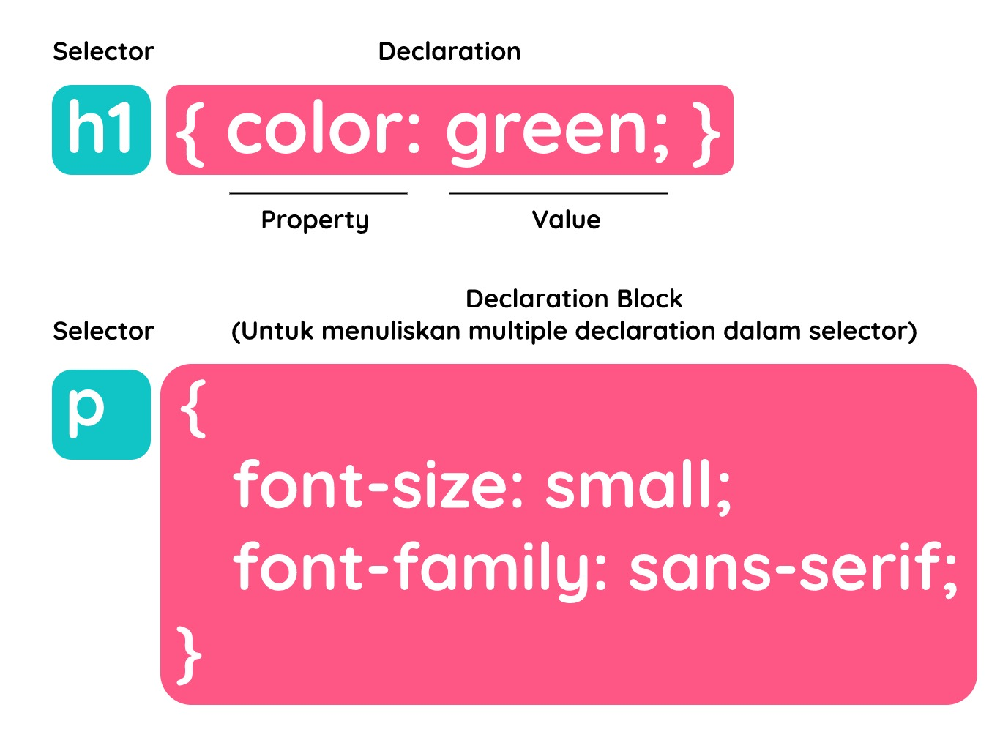

# Pengenalan dan Pendalaman CSS 

## Pengantar CSS

### Pengantar Pengenalan CSS

Website akan terlihat kurang menarik tanpa adanya CSS. **CSS (Cascading Style Sheet)** merupakan standar dari *W3C* yang digunakan untuk mengatur tampilan atau visualisasi halaman HTML. CSS bersifat *declarative language*, yaitu digunakan untuk mendeklarasikan nilai-nilai yang berfungsi mengatur tampilan elemen HTML di browser.

### Keuntungan dan Cara CSS Bekerja
Dengan menerapkan CSS, tampilan website akan menjadi lebih menarik.  
Berikut beberapa keuntungan menggunakan CSS:

- **Mengatur layout dengan presisi**  
  CSS memungkinkan kita membuat tampilan website yang rapi dan terstruktur, bahkan menyerupai desain dokumen cetak.

- **Menghindari penulisan berulang**  
  Styling dapat diterapkan ke banyak halaman HTML hanya dengan satu file CSS, sehingga lebih efisien.

- **Didukung oleh banyak browser**  
  Hampir semua browser modern sudah mendukung CSS, minimal CSS versi 2, dan sebagian besar sudah mendukung CSS versi 3.

### Menulis Aturan Styling
Dalam CSS, sebuah *rule* terdiri dari dua bagian utama:

- **Selector**  
  Bagian yang digunakan untuk menentukan elemen HTML mana yang akan diberi styling.

- **Declaration**  
  Bagian yang berisi aturan atau instruksi styling yang akan diterapkan pada selector.

### Melampirkan Styling pada Dokumen HTML
